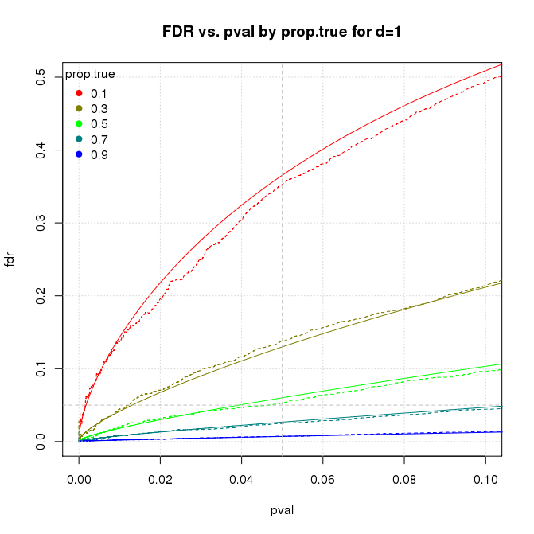
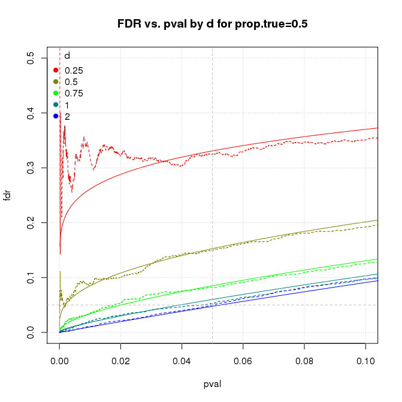

<!-- README.md is generated from README.Rmd. Please edit that file -->

*An R script and short article exploring the statistical concept of science-wise false discovery rate (SWFDR). Some authors use SWFDR and its complement, positive predictive value, to argue that most (or, at least, many) published scientific results must be wrong unless most hypotheses are a priori true. I disagree. While SWFDR is valid statistically, the real cause of bad science is "Publish or Perish".*

## Overview
The `swfdr.R` script reimplements the core idea in 
[David Colquhoun's fascinating paper](http://rsos.royalsocietypublishing.org/content/1/3/140216), "An investigation of the false discovery rate and the misinterpretation of p-values" and further discussed in [Felix Schönbrodt's blog post](http://www.nicebread.de/whats-the-probability-that-a-significant-p-value-indicates-a-true-effect/), "What’s the probability that a significant p-value indicates a true effect?" and related  [ShinyApp](http://shinyapps.org/apps/PPV/). Schönbrodt's post led me to blog posts by [Daniel Lakens](http://daniellakens.blogspot.de/2015/09/how-can-p-005-lead-to-wrong-conclusions.html), “How can p = 0.05 lead to wrong conclusions 30% of the time with a 5% Type 1 error rate?” and [Will Gervais](http://willgervais.com/blog/2014/9/24/power-consequences), “Power Consequences”. The term *science-wise false discovery rate* is from [Leah Jager and Jeffrey Leek's paper](http://doi.org/10.1093/biostatistics/kxt007), "An estimate of the science-wise false discovery rate and application to the top medical literature". Earlier work includes [Sholom Wacholder et al's 2004 paper](https://academic.oup.com/jnci/article/96/6/434/2606750/) "Assessing the Probability That a Positive Report is False: An Approach for Molecular Epidemiology Studies" and [John Ioannidis’s famous paper](http://dx.plos.org/10.1371/journal.pmed.0020124), “Why most published research findings are false”.

## Installation and Usage
The simplest way to get the software is to download the script [`swfdr.R`](https://github.com/natgoodman/swfdr/blob/master/R/swfdr.R) from the R subdirectory of the repository. The script uses base R capabilities only and will run "out of the box" on any (reasonably modern) R installation. 

The recommended way to run the script is to `source` it into your R session and run the statement `run();`  as shown below.

``` {r eval=FALSE}
## This code block assumes your working directory is the root of the distribution.

source('R/swfdr.R');
run();
```

This runs the program with default parameters producing four graphs similar to the ones below.  The default computation performs $2.5 \times 10^5$ simulations (taking about 3 minutes on my small Linux server).

```{r out.width="50%",echo=FALSE,fig.show='asis'}
;
;
knitr::include_graphics('figure/plot_vsprop.png');
knitr::include_graphics('figure/plot_vsd.png');
```

The notation is

-  solid lines show theoretical results; dashed lines are empirical results from the simulation 
-  *fdr*. false discovery rate, i.e., the probability that a significant p-value indicates a false positive
-  *pval*. p-value cutoff for significance
-  *prop.true*. proportion of simulated cases that have a real effect
-  *d*. standardized effect size, aka *Cohen's d*

The user can change simulation parameters and control program operation by providing new values to `run()` as illustrated in the code block below. The available parameters are

| parameter |     meaning     | default |
| ------------- | -------------------------------------------- | ------------- |
| prop.true | fraction of cases where there is a real effect | `seq(.1,.9,by=.2)` |
| m | number of iterations | `1e4` |
| n | sample size | `16` |
| d | standardized effect size (aka *Cohen's d*) | `c(.25,.50,.75,1,2)` |
| pwr | power. if set, program adjusts *d* to achieve power | `NA` |
| sig.level | significance level for power calculations when *pwr* is set | `0.05` |
| pval.plot | p-values for which we plot results | `c(.001,.01,.03,.05,.1)` |
|  |  | |
| scriptname | used to set output directories and in error messages |`'swfdr'` |
| datadir | data directory relative to distribution root | `'data'` |
| figdir | figure directory relative to distribution root | `'figure'` |
| save | save parameters, results, and plots; sets *save.rdata* and *save.plot*, not *save.txt* | `FALSE` |
| save.rdata | save parameters and results in RData format | `FALSE` (set by *save*)|
| save.txt | save results in txt format. **CAUTION: big and slow** | `FALSE` (not set by *save*) |
| save.plot | save plots | `FALSE` (set by *save*)|
| clean | remove contents of data and figure directories; sets *clean.data* and *clean.fig* | `FALSE` |
| clean.data | remove contents of data directory | `FALSE` (set by *clean*) |
| clean.fig | remove contents of figure directory | `FALSE` (set by *clean*) |

``` {r eval=FALSE}
## this code block assumes your working directory is the root of the repository

source("script/swfdr.R");

## run default process and save results in directories data/guide01 and figure/guide01
run(save=T,datadir='data/example01',figdir='figure/example01');

## reduce runtime by reducing number of simulation runs and simulated cases
run(m=1e3,d=c(0.25,0.5,1),prop.true=c(0.3,0.5,0.8));

## specify power directly and let program adjust effect size
run(m=1e3,pwr=c(0.1,0.3,0.8),prop.true=c(0.3,0.5,0.8));

## skip computation by loading saved results and replotting graphs
loadit();
doplot();

## load saved results and do something completely different
## eg, plot distribution of effect size error for small effects with significant p-values 
loadit();
with(subset(sim,subset=(d==0.25&d.true&pval<=0.05)),hist(diff-d));
```

## See Also

The article discussing the results is available in [html](https://natgoodman.github.io/swfdr/swfdr.html) and [pdf](https://natgoodman.github.io/swfdr/swfdr.pdf) formats on the [GitHub Pages site](https://natgoodman.github.io/swfdr) associated with this repository. It's also in the repository as files [swfdr.html](swfdr.html) and [swfdr.pdf](swfdr.pdf). (But note that GitHub, unlike GitHub Pages, renders html files as raw text).

## Author

Nathan (Nat) Goodman, (natg at shore.net)

## Bugs and Caveats

Please report any bugs, other problems, and feature requests using the [GitHub Issue Tracker](https://github.com/natgoodman/swfdr/issues). I will be notified, and you'll be apprised of progress.

## Copyright & License

Copyright (c) 2017 Nathan Goodman

The software is **open source and free**, released under the [MIT License](https://opensource.org/licenses/MIT). The documentation is **open access**, released under the [Creative Commons Attribution 4.0 International License](https://creativecommons.org/licenses/by/4.0).

